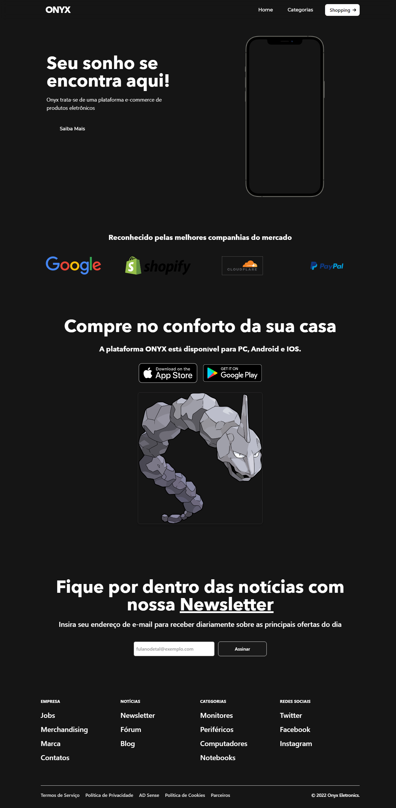

# Onyx Website

Esse protótipo página foi criado com o propósito de apresentar a minha equipe escolar uma idéia para um "projeto" que estariamos desenvolvendo na minha escola.
Onyx seria um E-commerce on-line focado na categoria de produtos eletrônicos(mouses, teclados, headsets, celulares, carregadores portáteis e etc).
Utilizado também para aprendizado sobre React, NextJS e TailwindCSS.
Nine-4

Esse projeto Next.JS foi utilizado juntamente com create-next-app



Para utilizar, após ter os arquivos e dependencias instalados em sua máquina, baixando/clonando o repositório..

## Ligar o ambiente


```bash
npm run dev
# OU
yarn dev
```
Abra http://localhost:3000 no seu navegador e verifique.

Para editar basta modificar os componentes, ou a própria index.js na raiz do repositório.

API routes podem ser acessadas em http://localhost:3000/api/hello. Para editar, modifique pages/api/hello.js.
Arquivos neste diretórios serão considerados API Routes e não React páginas do react.

## Learn more
To learn more about Next.js, take a look at the following resources:

Next.js Documentation - learn about Next.js features and API.
Learn Next.js - an interactive Next.js tutorial.
You can check out the Next.js GitHub repository - your feedback and contributions are welcome!

## Deploy on Vercel
The easiest way to deploy your Next.js app is to use the Vercel Platform from the creators of Next.js.

Check out our Next.js deployment documentation for more details.
